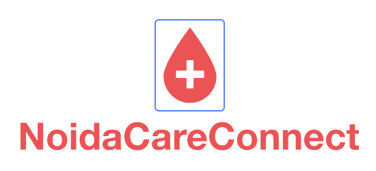

---

# Symptom-Based Disease Prediction Web Application

A web application that predicts potential diseases based on user-inputted symptoms using a trained Decision Tree Classifier machine learning model. The app provides personalized health insights, including recommended medications, dietary suggestions, workout plans, precautions, and detailed disease descriptions.

## Features

- **Disease Prediction**: Input symptoms to receive potential disease predictions.
- **Personalized Recommendations**: Get tailored advice on medications, diet, workouts, and precautions.
- **User-Friendly Interface**: Intuitive design for easy navigation and interaction.
- **Informative Descriptions**: Detailed information about predicted diseases to enhance user understanding.

## ScreemShot



## Installation

1. **Clone the Repository**

   ```bash
   git clone https://github.com/pranayguptag/Disease_prediction.git
   cd Disease_prediction
   ```

2. **Create a Virtual Environment**

   ```bash
   python -m venv venv
   source venv/bin/activate  # On Windows: venv\Scripts\activate
   ```

3. **Install Dependencies**

   ```bash
   pip install -r requirements.txt
   ```

4. **Run the Application**

   ```bash
   python app.py
   ```

5. **Access the App**

   Open your browser and navigate to `http://127.0.0.1:5000/`

## Project Structure


```plaintext
Disease_prediction/
├── app.py
├── datasets/
│   └── dataset.csv
├── models/
│   └── decision_tree_model.pkl
├── static/
│   └── styles.css
├── templates/
│   ├── index.html
│   └── result.html
├── requirements.txt
├── README.md
└── LICENSE
```

## Usage

1. Navigate to the homepage.
2. Enter the symptoms you're experiencing.
3. Submit the form to receive a predicted disease along with personalized health recommendations.

## License

This project is licensed under the MIT License. See the [LICENSE](LICENSE) file for details.

## Acknowledgements

- [Flask](https://flask.palletsprojects.com/) - Web framework used for the backend.
- [scikit-learn](https://scikit-learn.org/) - Machine learning library used for the Decision Tree Classifier.
- [HTML/CSS/JavaScript](https://developer.mozilla.org/) - Technologies used for the frontend.

---
